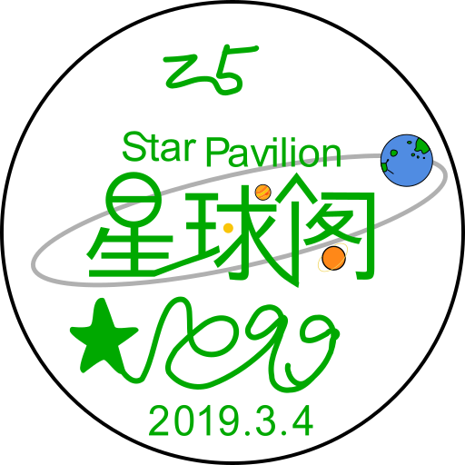

  <h1>欢迎来到SRPN历史网!</h1>
  

    这里记载了有关星球阁和少量关于星球圈的历史,您可以在这里了解它们的状况。
  

  
注：蓝色的字可以点。

  <h3>快捷跳转</h3>
  <button onclick="fun()" id="button">展开目录</button>

<noscript style="color: red"
  >javascript不可用！您无法使用跳转功能!</noscript
>

  <h4>目录</h4>
  <a href="#从头开始">从头开始</a>
  <h4>星球家族</h4>
  <ul>
    <li><a href="#星球家族的建立与发展">星球家族的建立与发展</a></li>
    <li><a href="#星球家族的审核制度">星球家族的审核制度</a></li>
    <li><a href="#星球家族的巅峰与衰落">星球家族的巅峰与衰落</a></li>
  </ul>
  <h4>星球阁</h4>
  <ul>
    <h5>前星球圈时期</h5>
    <li><a href="#星球阁的建立">星球阁的建立</a></li>
    <li><a href="#星球阁的成立之初的审核制度">星球阁的成立之初的审核制度</a></li>
    <li><a href="#新星球家族">新星球家族</a></li>
    <li><a href="#星球阁的继续发展">星球阁的继续发展</a></li>
    <h5>星球圈时期</h5>
    <li><a href="#星球阁影响力的再次提升和星球圈的形成">星球阁影响力的再次提升和星球圈的形成</a></li>
    <li>
      <a href="#星球阁与天文圈的交流以及知名度的快速增加">星球阁与天文圈的交流以及知名度的快速增加</a>
    </li>
    <li>
      <a href="#星球阁的短暂混乱和星球圈低质低俗化的开始">星球阁的短暂混乱和星球圈低质低俗化的开始</a>
    </li>
    <li>
      <a href="#星球圈的低质低俗化与星球阁的圈内地位的下降">星球圈的低质低俗化与星球阁的圈内地位的下降</a>
    </li>
    <li><a href="#中子星事件、科普君事件">中子星事件、科普君事件</a></li>
    <h5>转型运动时期</h5>
    <li><a href="#星球圈的沉寂和转型伏笔">星球圈的沉寂和转型伏笔</a></li>
    <li><a href="#转型运动的兴起与受阻">转型运动的兴起与受阻</a></li>
  </ul>

## 星球阁简史

### 星球家族

#### 星球家族的建立与发展

2019年3月4日，[星零](https://v.douyin.com/icGGKtH)于抖音建立了[星球家族](javascript:void(0))(SRCN,Star Clan)并发布[宣传视频](https://s1.imagehub.cc/images/2024/02/20/6db1804b44016b06bc7ab24655238b66.png)。几天之后，第二个成员[太阳系](https://v.douyin.com/ieMX2LBT/)便加入了这个组织，但这个组织还是冷冷清清。<small>(2023年8月13日注:在Nsakrty之前极有可能还有一名[成员](https://v.douyin.com/iJf3syf4/)加入了星球家族，目前尚未确定真伪)</small>

4月27日，[Nsakrty](https://v.douyin.com/NFYeNtm/)加入星球家族，由于其更新速度快，视频内容有趣，没多久就火了起来。这一做法引得星零也开始这么做。这样，短短十几天，星球家族便出现了两个粉丝过万的成员(星零、Nsakrty)。

#### 星球家族的审核制度

5月30日，Nsakrty发布了星球家族的[招人视频](javascript:void(0))。6月上旬，Nsakrty被升为副族长，随后，6月8日，Nsakrty制定了该组织的[加入条件](https://s1.imagehub.cc/images/2024/02/20/b4a77eaf813e77375abb351896422884.png)，29日又制定了试卷（[星球家族调查问卷](https://s1.imagehub.cc/images/2024/02/20/03b2d46d4a2cd5c052eea885f2f29d75.jpeg)）。

若要加入星球家族，加入成员的以下指标得分之和需达到60分及以上：

* • 获赞量：大于 500 得 10 分
* • 粉丝数：大于 50 得 10 分
* • 绘画能力：50 分
* • 试卷得分：30 分

试卷为固定试卷，共六题，选择题二题，三道选择题与一道画图题。审核制度起到筛选作用，使得星球家族内的成员更加高质。

除此以外，Nsakrty还在之后制定了各种计划，星球家族更强大了。

#### 星球家族的巅峰与衰落

6月，星球家族的总粉丝数破了10万，成员规模达到70人。

7月22日，星零粉丝破了10万，Nsakrty的粉丝也到了8万，星球家族进入巅峰时期。

2019年8月中旬，星球家族群聊由[青芒君（最佳鸽子）](https://v.douyin.com/iPV7RqD/)创建。

好景不长，9月，星球家族的发展逐渐陷入停滞。Nsakrty因个人原因停更了3个月，星零也在此期间对创作失去动力，并于 7 日正式将族长职位交接给 Nsakrty。随着核心成员活跃度下降，组织凝聚力开始削弱，10月，星球家族内部的斗争愈演愈烈，成员关系紧张。10月20日前后，星球家族解散，组织内一片混乱。<small>(2023.08.14注:星球家族在2019年11月到2020年4月这段时间还出现过许多次)</small>

### 星球阁

#### 星球阁的建立

2019年10月26日前后，原星球家族成员[史小坑](javascript:void(0))（此史小坑非彼史小坑）建立起了一个新组织——[星球阁](../index.html)(SRPN,Star Pavilion)。或是因为他想取代星球家族、或是因为好玩而建立、或是因为来“避难”，总之，建立它的原因还是个谜。

那些在混乱中还没退出星球家族的成员纷纷加入了星球阁，同时也迎来了几个新成员。

在接下来的几个月中，Nsakrty和星零都掉了粉，只有部分成员还在缓慢的涨粉。星球阁此时也并没有什么大作为。

2020年2月2日，Nsakrty[当上星球阁阁主](https://s1.imagehub.cc/images/2024/02/20/2e7057f79e32805b1f14f30e47009fee.jpeg)。

2月29日，Nsakrty尝试制作粉丝数量统计视频，但以失败告终。

2020年2月中旬，星球阁主群创建，在这之后进行了多次换群。

3月28日，Nsakrty为星球阁设计出了[第一代logo](https://s1.imagehub.cc/images/2024/02/20/f2812b3c9602e587c45f479309a1dd65.png)。几天后，Nsakrty、[天体君(OceanHalo)](javascript:void(0))、[水货](https://v.douyin.com/iJf3UUTu/)等成员开始共同设计星球阁的[第二代logo](../icon/SRPNlogo.svg)，此logo于4月7日制定完成。

5月，改变发生了。Nsakrty的一条[视频](https://v.douyin.com/iPqU4bc/)让他在6月破了10万粉丝，同时，其他成员也开始火了起来。但星零在此时注销了她那有12.7万粉丝的账号。

#### 星球阁的成立之初的审核制度

星球阁创立初期，审核制度基本照搬了星球家族的旧模式，使用相同的入阁试卷。然而在 2020 年 4 月前，由于组织结构不成熟，新成员的加入方式存在较大差异，有部分成员在未经完整审核的情况下直接入阁。这种不统一的审核机制，导致成员素质参差不齐，也促使后期制度改革的推行。

4月4日，星球阁自主研发出试卷生成器，作者是Nsakrty，其目的是防止别有用心之人记录答案发给别人，该试卷生成器在 iPhone 上的快捷指令应用上运行，入阁试卷完全随机生成，通过分标准约为总分的75%。入阁试卷主要分为：天文题，道德题，画图题。新的试卷很好地防止了作弊问题。

#### 新星球家族

2020年5月29日前后，因未知原因，Nsakrty宣布[解散星球阁](https://s1.imagehub.cc/images/2024/02/20/4b9ca77773f6d9d487fa3562f4ace680.jpeg)，一天内，就有那么一群人[自发拯救这个组织](https://s1.imagehub.cc/images/2024/02/20/28c9331e8ee7bad28502ac9d7b5019c4.png)，创建了新星球家族(New Star Clan)，定下了以下标准：

1. 禁止有违规内容
2. 要团结一心
3. 素质要好
4. 新组织不要分级，要人人平等

把Nsakrty看得泪流满面，又加入回来了。

在规矩制定后，新星球家族实行投票制，然而效率并不高，进入新星球阁时期后，投票制的地位逐步下降。但不可否认的是，这些规矩为初代星球阁条例奠定了基础。新星球家族是短暂且意义重大的。

#### 星球阁的继续发展

2020年6月21日前后，新星球家族改名为星球阁(SRPN,Star Pavilion)。

7月10日，星球阁搭建自己的[网站](https://xingqiuge.mysxl.cn)。这个网站是星球阁的第一代网站，现已停更并下线。

9月中旬，星球阁对新星球家族的规定进行完善，制定[《星球阁条例》](https://s1.imagehub.cc/images/2024/02/20/171aa7b20ef3363c58772eb618d69bfd.png)，最早的星球阁条例规定了组织的性质、成员的行为和视频的制作，对星球阁未来的走向产生了影响。时至今日，你仍能从[现在的《星球阁条例》](TL.html)中看见第一代条例的影子。

9月末，Nsakrty成功制作了[第一版粉丝数量统计视频](javascript:void(0))。

10月10日前后，星球阁的缩写正式被定为SRPN，也是在这几天，SRPN开始用来标记星球阁成员网名<!-- (Nsakrty带的头)。 -->

11月8日，[狗头君花粉](javascript:void(0))[申请加入星球阁](https://s1.imagehub.cc/images/2024/02/20/2d80f422e2793afe13969cf7f06e2a02.png)，虽然他有20万粉，但他的加入过程并不顺利，一个月后，他终于成功通过了星球阁的审核。而此时的他，粉丝数已经达到了50万，他的加入，让星球阁的总粉丝数破了100万，并且还在继续提高，星球阁的成员数也随着他的粉丝增长而快速增加。可是，随着时间的推移，狗头君花粉多次违反《星球阁条例》，成员们越来越忍受不了他，2021年春节前夕，经投票，狗头君花粉被永久踢出。

t出狗头君花粉的那十几天，各种骂声随即而来，而Nsakrty因为是传播信息的主要人物，所以成为这次事件的焦点。

2021年1月31日，[SRPN网](../index.html)建立，一开始的网址为srpn.rthe.xyz。然而此时这个网站的排版和样式都极其烂XD。这是星球阁的第二代网站。

2021年2月10日，星球阁总部迁移，建立了新的主群，这个群用到了2022年1月1日。

2月28日，波兰球圈成员[血泪](javascript:void(0))和星球阁合作，创建了星球阁分组织[波兰星球](javascript:void(0))(SRPB,Star PolandBall)，可是没过几天，由于规则制定问题以及审核的极度宽松，组织内部一片混乱，一周不到解散了。3月3日，[星球编程](https://github.com/SRPNGO)(SRPG,Star Programming)建立，领导人为Nsakrty。

7月9日，星球阁新增第二个审核员[Atpx](https://v.douyin.com/NFYSD1o/)。

7月中旬~8月末，由于血泪对星球阁管理制度的不满以及和Maugfy等人的矛盾，发生了[血泪事件](javascript:void(0))。在此时，血泪为星球阁高层成员之一，对星球阁的改革措施激进，主群内争执与反对声不断。

8月24日，Nsakrty写了有关于星球阁迁移计划的决定，主要是用[qn](https://v.douyin.com/NFFc7G7/)提出的“空城计”让血泪对星球阁失去兴趣，也就是将活跃成员拉进另一个群进行讨论交流，久而久之，计划果然生效，血泪退群，大家回到了总群。但是这一处理措施侧面反映了当时星球阁高层的懦弱。

由于此时星球阁成员创作热情普遍下降，全员基本处于掉粉状态。7月以后直到11月，无新成员加入。

#### 星球阁影响力的再次提升和星球圈的形成

8月27日，[Earth-2](https://v.douyin.com/NFY8Lsw/)模仿[Dogepro的视频](https://www.youtube.com/watch?v=3oIdpdK2z3A)，制作了[星球阁第一个恒星发展历程的视频](https://v.douyin.com/hpbYDK3/)，没多久便大火，星球阁再次进入网友们的视线。在这之后，越来越多的人开始制作恒星生命历程的视频。这也是星球阁走向巅峰的开始。

12月1日，Nsakrty将阁主交给qn。

2021年12月前后，[《星球阁简史》]( )重写完成。

2022年1月1日，Nsakrty试图把星球阁群聊的群主换成自己的小号，但是因bug，群主意外转成了别人，失去了群聊控制权，Nsakrty只好重新建群，并邀请原群中的成员进来。

1月中旬，发生了[怀壹事件](javascript:void(0))。

2月以后，星球阁影响力变得更大，并且一些类似的组织也开始破土而出，Nsakrty认为：创建可以，模仿可以，但是绝对不允许照搬或者抄袭星球阁的制度，包括但不限于条例，名称（包含星球阁三字），入阁试卷等。对于这类组织，Nsakrty表示强烈谴责。星球圈也是在这时开始形成的。

2月16日，Nsakrty制作试卷生成器安卓移植版，结束了生成试卷只能用 iPhone 的限制。

3月4日下午，SRPN网进行了一次大更新，样式做了全面更改，在5日还加入了logo图标，提高了阅读体验。

4月6日，星球阁一个附属组织——[星球摄影](http://srpn.top/sron/)(SRPY,Star Photography)成立。组织领导人为[新智彗星](https://v.douyin.com/NpHXqGY/)。

4月25日，SRPN网开始使用Javascript。同日[SRPY网](http://srpn.top/sron/)成立。

5月14日，因热度降低、错误较多、制作时间长等，Earth-2[宣布停止更新恒星生命历程](https://v.douyin.com/hpbgxV3)，开始转而更新其他系列。同日，为应对一群人满的情况，星球阁二群由qn创立。

5月26日，因成员冒充现象频出，Nsakrty开发[星球阁成员检测器](MrDt.html)。

同时，在5月到9月期间，星球圈发生了一次整体的画技大提升，部分人又称其为“画质爆炸”。这次的画技提升由[青菜](https://v.douyin.com/h3tRAP4/)引发，随后圈内的大半成员都开始提升自己的画技和视频制作技术，画出来的星球越来越真实。这也成为一年后圈子水平两极分化的一个主要原因。

#### 星球阁与天文圈的交流以及知名度的快速增加

6月11日，[星球阁开始在BiliBili试行审核](https://s1.imagehub.cc/images/2024/02/20/52cbe71ffde19f5564c05ccdf75c4b44.png)。

6月末，“[Dogepro首席打假员](https://space.bilibili.com/483704842)”认为Earth-2、[Maugfy](https://v.douyin.com/SXo52ND/)等天文圈成员未经授权在视频中使用了[Dogepro](https://twitter.com/Still16708)的音乐，不久后“Dogepro首席打假员”便联系上了Dogepro本人，随后Dogepro发表[声明](https://www.bilibili.com/opus/677437731414999079)：不要去抄袭、盗用他的音乐作品。不久，Earth-2等人与Dogepro首席打假员取得联系，并积极解决此事，后于7月13日[获得授权](https://www.bilibili.com/opus/682412506174455861)，可以在标注的情况下合法使用Dogepro的音乐。

7月9日，星球阁创建一个测试群(新智彗星创建后转让群主给Nsakrty)。中午，该群成为临时主群。此群容量应该为200人，若假设成立，该群将立刻作为星球阁新主群，并废止其他星球阁群。但是经过20多天的测试，可得该群实际容量仍为100人，所以在7月27号，此群的使命结束。

7月18日，由青菜为Earth-2、星零、她自己以及Nsakrty的皮肤在《我的世界》上陆续上线。

7月26日，星球阁采用新的审核标准，新审核标准将试卷拆成两卷，第一卷（非画图题）一审通过分为标准的78%，画图题满分35，通过分22，只有两卷得分均通过标准才可进入，这么做对所有考生都更公平了（以前的标准只对试卷总分高的人友好，具体原因略）。

8月14日，又一个附属组织[星球历史](javascript:void(0))(史书阁,SRPH)成立。

8月21日，Nsakrty开发新一代试卷生成器，该生成器完全由JavaScript编写，不仅提升了试卷生成速度，还使得试卷生成器真正实现了多端运行。

9月25日，星球摄影(SRPY)改名为星球观测(SRON)。

10月3日前后，新智彗星创建新的测试群并担任群主直到解散。11月中旬，成员人数正式突破100人，随后正式成为新主群。

2022年6月至12月，Dogepro事件结束后，由于大量新成员的涌入以及青菜所领导的画质升级运动的全面展开，创作形成良性循环，星球阁各成员流量和知名度迅速上升，整体空前繁荣，各成员因创作关系紧密联系在一起。在此期间，星球阁总粉丝数由原先的60万迅速上升至120万。

10月下旬，在流量迅速增长的大背景下，部分星球阁成员决定入驻快手平台并在之后取得不小成效，[但此现象被认为在一定程度上推动了“快手星球动画圈”的成型](https://s1.imagehub.cc/images/2024/02/20/dcc9e98d1227607833754f0a0e99a670.jpeg)。

2022年11月5日，qn与Nsakrty共同担任星球阁阁主，7天后，经成员投票，阁主转为Nsakrty，副阁主为qn和青菜。

12月9日，星球理科(SRMP)成立，11日被列入星球阁分组织。

12月，是星球阁在b站知名度增长的最快的一个月。7日，Earth-2在一个关于星球阁的投票下发布[引战言论](javascript:void(0))，后引起众怒，骂声不断。Earth-2与该作者的[事情](https://s1.imagehub.cc/images/2024/02/20/1fd9ae0c19ebf94c1d5cce9596172a67.jpeg)解决后，Earth-2宣布离开b站。13日，由青菜制作的星球阁周边商品在抖音上架，此事很快传到b站天文圈，反响很不好，随后青菜删除了此商品的宣传视频。然而，一些天文圈的成员打着以“净化圈子环境，提高整体天文水平”的旗号，一方面恶意攻击星球阁成员，给视频“捉虫”以及对作者进行嘲讽，另一方面又对一些同水平的圈子成员的错误相当宽容，这种行为引来了不满。

12月17日，星球阁高层成员制定了[《对违反星球阁成员的处罚标准》](violations.html)(又称星球阁处罚条例)。

12月23日21时，[星球阁首个破百万点赞的视频](https://v.douyin.com/hpXQevb/)出现。但是在几天之后被恶意举报下架。

#### 星球阁的短暂混乱和星球圈低质低俗化的开始

12月末，[Hliva](https://v.douyin.com/ieBsXJpv/)因手机绑定问题注销[原账号](javascript:void(0))，许多人得知消息后纷纷发视频纪念他。然而，他向Nsakrty表示了1月1日会回归的消息。在当时由于二人想给其他成员制造惊喜，所以选择了“演戏”的方法（假装一个新成员回到星球阁，并在1月1日当天公布自己的身份），但在这期间由于Hliva和Nsakrty的失误，意外引起了审核员新智彗星对Hliva的不满甚至引起了双方的矛盾，这也成为了新智彗星事件的导火索。

2023年1月3日，因群主新智彗星[受刺激](https://s1.imagehub.cc/images/2025/06/21/36032c579b1fc9259a4991937ad5620d.jpeg)，[解散了星球阁主群](https://s1.imagehub.cc/images/2024/02/20/8b2d68a923de04559a2ed1b5f4f01154.jpeg)，并且退出星球阁、带走附属组织SRON。这一天，由于2022年末以来种种矛盾的积累，多人退阁意愿增长，成员情绪普遍低落，星球阁审核暂停。此事件被称为[“新智彗星事件”](javascript:void(0))，它和之后的LESH事件是星球阁历史以来遇上的破坏性最强、影响力最大的事件之一。在这之后，许多类似星球阁的组织诞生。这是星球圈两年动乱的起点，星球阁就此偏离原有发展道路。

1月3日，受新智彗星事件的推动，成员[Mr.Liu](javascript:void(0))退阁，并于9日发布了一条视频，表达了对星球阁状态的担忧，对星球圈的发展持悲观态度，随后，多个成员接连发表类似观点，质疑组织疑似“存在粉丝歧视”的现象及其管理方式不到位，内部矛盾迅速激化。然而，Mr.Liu的视频中其中的一些观点受到了一些成员的反对，他们声称“Mr.Liu等人带节奏也是圈子状态变差的一个原因”，不久，反对者与原作者之间的冲突越来越剧烈，最终演变为广泛争论与成员分裂，引发了被称为[“LESH事件”](javascript:void(0))(Mr.Liu、[Earth-1](httpsd://v.douyin.com/iLgXKmVh/)、[石浪](https://v.douyin.com/iLg4dVAx/)、[海稻](javascript:void(0))事件)的冲突。1月13日，海稻退阁，1月30日，石浪、Earth-1因言行过激违反条例而被踢出星球阁，导致二人极其不满。之后Mr.Liu、Earth-1、石浪、海稻四人成立了反对星球阁的组织[“同盟会”](javascript:void(0))。

2月12日，LESH事件的影响达到了最大点，星球阁主群在一次混乱后开始了长时间的禁言，该政策持续了两个周直到2月23日晚，长期禁言引起了部分成员的不满，但是禁言也起到了实质性作用——在这期间冲突减少了很多。后来，新智彗星回到了星球阁，LESH四人建立的反星球阁组织在被打击后，Earth-1、Mr.Liu、石浪也不再热衷于此事并于之后陆续回到星球阁，海稻注销，LESH事件结束。LESH事件与新智彗星事件密切相关，星球阁、星球圈成员心态的不稳定造成的误解也是LESH事件影响大的原因之一，这次事件不仅给其参与者带来了许多负面影响<small>([2024年3月9日Earth-1对LESH事件的声明]( https://v.douyin.com/iF6aADFN/))</small>，也导致了星球阁阁内舆论氛围变差、名声下降、成员积极性下降以及短时间内引起了大量成员退圈。该事件不仅反映出圈内管理与沟通机制的问题，也被视为星球阁影响力下滑的转折点之一。

LESH事件发生的同时，1月中旬，有人开始在抖音发布了[带有低俗元素的“星球视频”](https://s1.imagehub.cc/images/2025/06/21/2c05b314592343ebf428e2a3f887820a.png)，接着，又有许多人跟着一起发布这种视频。此类视频质量极低(星球全部用的网图)、内容低俗但却很火，对圈子产生了极大的负面影响，多个星球阁成员举报了此类视频。这种视频也被称为“星球动画”。星球动画的迅速兴起给星球阁各成员流量带来了前所未有的巨大打击，各成员流量被挤压，加之组织混乱，致使Earth-2、青菜、Maugfy、天白、水益、参宿四、北河三、Lan09Aa等大量星球阁成员不再系统性更新星球系列视频，逐渐淡圈，退圈，星球阁在星球圈中的影响力和话语权大大降低。在此之后，大量的星球阁成员投身到了如何救圈，救阁的奋斗当中，流量复苏和寻求转型成为了星球阁成员在这一时期的主要任务。

1月24日，SRPN网更换网址为www.srpn.top。

1月26日，星球阁新增一个新的于1月3日由[佰玖](https://v.douyin.com/kE9RW8C/)创立的分组织：[星辰阁](javascript:void(0))(SRDC)。

1月27日15时，[Maugfy的b站账号](https://space.bilibili.com/1170714365)破一万粉丝，成为了在b站中第一个粉丝破万的星球阁成员。

2月18日，星球阁试卷改良完成，调整了天文题的难度等并恢复审核。

3月18日，SRPN网进行第二次样式更新，更改了网页排版。

#### 星球圈的低质低俗化与星球阁的圈内地位的下降



自2022年11月起，一些来自星球动画圈的低创低俗视频在快手诞生。因新智慧星事件和LESH事件的影响，星球阁无瑕顾及此类低创视频的在抖音的传播，导致2023年1至3月期间，星球动画视频进入抖音，给圈子造成了极大的不良影响。部分星球阁成员开始发文、发视频抵制这些视频，但并未起到实际成效，在这之后，星球阁的近乎所有成员涨粉速度开始放缓，总粉丝数开始下跌。

4月28日，因博主“[科学商所长](https://v.douyin.com/i5rScE3/)”发布了一些低质量星球动画视频，星球圈的一些成员和他发生了舆论冲突。

5月1日，[Earth-2成为星球阁粉丝数最高的成员](https://public.flourish.studio/visualisation/13615855/)。

5月2日，为提高圈子视频质量，Nsakrty制定[《星球圈绘画守则(征求意见稿)》](../article/ptcd.html)，然而由于宣传力度不足，此规定起到的作用微乎其微，管理范围仅限星球阁阁内。

6月7日，[星球观测SRON](srpn.top/sron)由新智彗星重建。

6月16日，因Nsakrty将要中考，学业压力开始增大，阁主再次换为qn——但权力中心并没有发生实质性的转移。

6月22日，SRPN网第三次样式更新，首页加入动效。

6月末，星球阁成员发现快手星球动画圈的博主[“疯狂的宇宙”](javascript:void(0))以2元的售价售卖星球动画的制作教程。然而圈内有相当数量的人评价此教程水平低并反对此行为。7月中下旬，快手突然掀起了一股反星球圈的热潮，许多人对星球圈低俗低质严重、素质低下的现状以及“疯狂的宇宙”售卖低质量星球动画教程的行为进行了批判。

6月27日，为了研究星球阁未来道路，青菜等人作出在星球圈基础上的转型尝试，开始制作3D星球视频，此技术快速在星球阁内传开，但并没有迎来转型或流量的复苏。

7月6日，在[极光](https://v.douyin.com/ieMQb5YQ/)的组织下，[星联阁](https://skdc.rth1.link/)成立。一方面，星联阁整合了当时星球圈中散乱的成员，但另一方面，由于星联阁整合的成员总体素质参差不齐，且组织成立初期缺乏完善的管理规则，内部矛盾频发，这些矛盾通过跨组织互动不断外溢，最终加剧了星球圈的混乱，其自身也演变为混乱中心。

7月13日，此时已有80万粉丝的“科学商所长”突然修改简介，称自己为[星球阁阁主](https://s1.imagehub.cc/images/2024/02/20/01fbc31f85b7e4e377d52df15f63c6bc.jpeg)，Nsakrty、青菜等多次与之交涉。19日，在交涉下，科学商所长将背景图和简介均修改回原状。这次事件是首次发生在星球阁身上的侵权事件。10月29日，科学商所长表示从此不再参与此类事件。而在科学商所长事件中，除了Nsakrty和青菜等人与之的交涉，成员“[中子星](https://v.douyin.com/iJN8PyGM/)”也同样与科学商所长进行了较为缓和的交涉，但由于当时的高层普遍较为激进加上中子星个人本身的一些问题，被认为维护低创和[洗白科学商所长的侵权事迹](https://s1.imagehub.cc/images/2024/02/21/bf8fe1400a9c6a822f10563158e7d395.png)，最终中子星被踢出星球阁，7月26日，因有关中子星和星球动画的矛盾，星球阁开始加强条例执行的力度，短时间内处理了约10人（包括极光，中子星等），由于此时的星球阁成员普遍对星球动画非常反感，在这期间高层普遍过于激进，所以也发生了一些执行上的错误。这引起了阁内外一些人的不满，最终引发中子星事件。

#### 中子星事件、科普君事件

中子星在26日被踢出后，于当日建立了光启阁，整合了大量抖音星球动画圈成员，光启阁的成立也使得许多类似于星球阁的组织诞生，也进一步加剧了星球阁与星球动画的整体矛盾。7月31日，成员“[Zhang](https://v.douyin.com/ieMCNhaF/)”与中子星之间的矛盾升级，在扩大后导致了星球阁和光启阁的直接冲突。在这期间，极光对事件的解决起到了积极作用。

8月末，中子星事件逐渐平息。同时，中子星事件严重打击了星球阁在圈内的地位，星球阁逐渐不被广大的星球圈成员所知，取而代之的是各类新型的类星球阁组织。

8月，[MG](javascript:void(0))和Nsakrty进行了试卷制度的最后一次改革，重写了题库并重新加入了道德题。然而由于星球阁长期以来审核的暂缓和圈内地位、知名度的下降，这次改革并没有成功。

9月13日，曾被星球阁踢出的科普君介入中子星事件，再度引燃冲突，星球阁主要矛盾对象转向科普君等人，发生了第一次科普君事件，该事件在之后演变为军武阁和星球阁之间的直接冲突。

起初，科普君和中子星在舆论上并不占上风，他们也[承认“只对人而不对阁”](https://s1.imagehub.cc/images/2024/02/21/f38f25350772d770183e2585930d134e.jpeg)。9月20日，星零被军武阁方面挖出露脸照并被科普君等人大肆传播，第一次科普君事件开始发生转折。在这之后，该事件规模不断扩大，局势走向失控边缘。9月27日，Nsakrty被迫签下所谓“和平条约”，第一次科普君事件结束，但该"条约"在内容上存在诸多[漏洞](https://s1.imagehub.cc/images/2024/02/21/340988f91b201549cdf8e8c608ef5ffc.jpeg)。科普君和中子星在签订条约后仍多次引发矛盾。10月2日，光启阁内甚至出现了[一些成员公开攻击星球阁的现象](https://s1.imagehub.cc/images/2024/02/21/e09516e3af26820b78d6977553374dfd.png)，这些种种不平等的现象导致了星球阁成员的极度不满，10月中旬，由于条约的不平等，星球阁也停止了对科普君话题的管制，这也间接导致了第二次科普君事件。

中子星事件和第一次科普君事件事实上使得星球阁在星球动画圈中的评价迅速下降，也严重打击了星球阁应对星球动画问题的积极性。

11月4日，因试卷筛选能力的严重下降和星球阁外部矛盾的加剧，星球阁停用试卷审核制度。

12月6日，科普君拟定“冲突白名单”并再次引燃冲突，并意图策反[水益](https://v.douyin.com/iNemFoES/)以削弱星球阁核心力量，标志着第二次科普君事件爆发，第二次科普君事件规模较第一次时间更长，规模更大，涉及更广，冲突范围由原先的数人扩展至全星球阁，12月31日，军武阁主群被毁，第二次科普君事件结束，但军武阁并未就此消亡。

#### 星球圈的沉寂和转型伏笔

科普君事件后，由于缺少外部流量供应，星球圈走向最终沉寂，阁内绝大部分的成员都停更或缓更了星球视频，或多或少淡出了星球圈，但也有部分成员开始尝试视频内容上的初步转型。10月16日，成员[Acubens-A](https://v.douyin.com/Cei9VHm7/)制作的新型物理抽象科普视频突然爆火，其粉丝数迅速增长的同时，一些星球阁成员也看到了新的出路——知识科普，成为转型运动的重要伏笔。

2024年1月-4月，星球阁军武阁矛盾的结束也为星球阁争取到了一些和平发展的空间，2月2日，星球阁进行了高层成员的招新与职位的更改。Nsakrty与青菜卸任副阁主，qn卸任阁主。副阁主位置由水益、[天白](https://v.douyin.com/iNemBHf7/)、极光三人接替，阁主暂无。2月19日，新智彗星担任副阁主。2月20日，星球阁重新开放审核。新的审核制度不再包括入阁试卷，这大大降低了进入星球阁的难度，也提高了星球阁审核的灵活度。3月9日，星球阁官网进行了第四次样式更新，部分网页被改为图文并茂的形式。

2024年2月，星球圈大部分已有的组织开始团结起来对抗军武阁。虽然其直接导致了军武阁的彻底覆灭，但由于两次科普君事件以来，各类复杂思想的大量涌入，导致星球圈成员思想紊乱；且由于中子星事件后大量新兴组织的建立所致的权力分散、各阁发展不均衡以及时任星球阁副阁主水益重大决策失误（并未发现混乱风向的转变与及时制止混乱，误认为军武阁残存势力仍在，继续支持混乱）等问题，最终在军武阁覆灭后引发了星球圈大规模混乱。该混乱反映了四三〇事件前星球圈低龄化趋势和成员综合素质走低的加剧，实质上是两次科普君事件的进一步延伸。在此期间，天白、小北菌等人做出过制止该混乱的尝试。这些尝试无疑是正确的，但在当时历史条件下由于缺乏广泛成员认可和阁内成员思想混乱等实际性问题，加之本身处理方式较为激进，虽出发点正确，但最终成果却不尽人意。

4月30日6时，大量星球圈成员和群聊被无故封禁，直接导致了星球圈大规模混乱的结束，本次事件被称为“四三〇事件”。数月后，科普君本人账号也被封禁，科普君就此消身灭迹，也标志着星球阁主要矛盾对象的消失。两次科普君事件既体现出星球阁在危机公关、对外发声方面的短板，揭示了圈层内复杂的博弈关系，极大程度推动了星球阁与星球圈的脱钩。

四三〇事件也标志着星球圈两年动乱和自2023年4月以来科商事件及其一切连锁事件的彻底终结，星球阁发展主题重新回归发展，为转型运动的到来作了至关重要的铺垫。

5月4日晚，星球阁主群被封，随后重建了新主群。此事给星球圈、星球阁造成了极大影响。加之此前发生的星球圈大规模混乱和四三〇事件几乎摧毁了2024年2月刚刚建立起来的新高层权力体系的平衡，星球阁再次陷入短暂发展停滞，这次停滞于8月末转型运动的兴起而结束，但新高层权力体系的失衡也为一年后的高层分裂埋下了祸根。

8月4日，高层成员为应对新的时代条件下星球阁发展困境，进一步完善了审核制度，经讨论通过确立了新的内外层组织结构：主群为内，二群为外。依照新结构，星球阁创建二群，并招入了十余位新成员。星球阁从此完全抛弃了四年来逐步僵化的旧试卷审核制度，开始转向灵活。在当时的历史条件下，二群的建立一定程度上阻挡了低质量成员的涌入，让星球阁在星球圈当混乱中仍能保证新成员质量，为星球阁之后的稳定发展争取了空间，但新成员从二群到一群的漫长之路也劝退了不少想要加入星球阁的成员，并在一年之后引发了新的发展困境。

#### 转型运动的兴起与受阻

经历近两年动乱，星球阁已几乎丧失原先在星球圈的地位和话语权，这两年组织粉丝总量净增长不足5万，受星球动画挤压，几乎全部的成员都选择了淡圈或停更的道路。但与之不同的是，也有一些成员自发的去寻找新的出路，2023年末以来Acubens-A所创作的新型物理科普视频使得其流量与粉丝数量一直稳步增长，至转型运动前夕，Acubens-A已获得近10万粉丝。2024年8月末，[天白](https://v.douyin.com/iNemBHf7/)在原有的星球圈基础上作出转型尝试，发布了几期类似[B大附中](https://space.bilibili.com/499453755)的抽象鬼畜视频，获得了少量流量，取得了初步成效，走上了抽象的道路，标志着转型运动的开始。

Acubens-A和天白的转型虽在个人层面成效明显，但也仍未引发真正“运动”层面的转型。与此同时，Earth-2吸收并了这两种视频创作模式，将鬼畜音效与知识科普结合<small>（争议观点，待考证）</small>，发布了第一期真正意义上的“抽象科普”视频——《暴力制氧》。但这期视频也因照搬天白早些时候一视频呈现形式而引发阁内成员的批判。10月19日，Earth-2粉丝突破20万，这是自Nsakrty2022年1月中旬掉出20万粉丝以来，星球阁再次出现20万粉丝以上的成员。

巨大的流量前景在星球阁内拉开了转型的序幕，在这之后，天白吸收了科普的创作模式，Acubens-A则在视频内融入了部分搞笑、鬼畜音效，改进视频风格后的两人都获得了巨大的收益。10月26日，[Maugfy](https://v.douyin.com/SXo52ND/)所发布的一期同为抽象科普的《水循环》取得大火，在他11月2日突破10万粉丝的约一周后，这期视频也成为了星球阁历史上[第二个破百万点赞的视频](https://v.douyin.com/CeinsT8D/ 08/01)，给当时的其他星球阁成员带来了巨大的动力，真正颇具规模的转型运动开始展开，[水益](https://v.douyin.com/iNemFoES/)，[海山二](https://v.douyin.com/QCI08PdlBjs/)，[Earth-5](https://v.douyin.com/iJf3UUTu/)等都开始制作与之类似的视频。月末，Maugfy粉丝超过Earth-2，成为星球阁粉丝数最高的成员。12月15日，Maugfy在其[星球阁第三个破百万视频](https://v.douyin.com/b9eDz9SplFg)《海岸地貌》热度的加持下破了30万粉丝，星球阁粉丝增长速率创下自2022年以来的最高水平，整体流量呈现出一片繁荣景象。



但是，转型运动第一阶段的流量繁荣是属于少数人的，由于抽象鬼畜的创作模式并不适应所有创作者，早期参与转型的一些成员在视频创作上的投入与视频发布后获得的回报不成正比，这对转型而言本身就是一种打击。针对此类困境，一些成员开始寻求知识科普背景下新的出路并进行探索与尝试。

2025年1月，[XF](https://v.douyin.com/uRZzwNZOghA/)与Nsakrty等人开始尝试新的视频模式。1日，XF发布了一期新型的知识类手书视频《一次函数》，并在春节前夕流量开始有所起色，21日，Nsakrty也发布了一期学科动画视频《“简单的”三角恒等变换？》，随后迅速爆火，3天之内涨粉一万，并在1月27日重新突破20万粉丝。这期视频随后被Acubens-A、Earth-2等成员模仿，其中Acubens-A的视频点赞量突破百万，成为[星球阁第四个破百万赞的视频](https://v.douyin.com/qynZzR1vF-w/)，而后于4月11日成为了星球阁历史上首个点赞量破200万的视频。与抽象科普视频相比，在更低的创作成本与更大的流量回报下，学科燃剪迅速替代抽象科普，成为转型运动的主流视频模式，这标志着转型运动第二阶段的到来。

但由于流量的差异并没有得到根本解决，加上2023年以来成员矛盾与组织戾气的长期积累，滋生了新一轮成员矛盾和高层分裂，1月22日，Earth-2与天白等人发生了矛盾，主要是围绕原创/抄袭等问题而展开并引发针对相关问题的辩论。同日，SYUN建立，次日，矛盾冲突点转向其他成员并在当日晚发生了激烈争论，但由于缺乏客观依据与事实依靠，最终这场争论草草结束，这两日所发生的事件，虽出发点合理，但由于处理的过程较为激进，在一定程度上打击了当时成员的创作热情（尤其是在抽象科普领域）并改变与重组了成员关系，对之后的发展趋势产生了深远影响。

1月27日，星球阁进一步简化审核，全面开放二群。

2月2日，星球阁官网进行样式第五次更新，这次更新切换了主题颜色。

3月，[星球阁第五个破百万赞的视频](https://v.douyin.com/LgB_GJ0mjp4/)诞生，此视频由Acubens-A和Nsakrty共同创作。同时，XF更新的力学与压强的三期动画视频迅速爆火，三周内涨粉近6万。

4月4日，Maugfy粉丝破50万。

{% include image-box.html src="https://s1.imagehub.cc/images/2025/07/09/218f6cc9144ed4dbdbdefbf6fc1fb373.png" caption="<a href='https://s1.imagehub.cc/images/2025/07/09/218f6cc9144ed4dbdbdefbf6fc1fb373.png'>'转型运动'进程图</a>" width="60%" %}

5月18日，[星球阁第六个破百万点赞的视频](https://v.douyin.com/faiixYBJxBg/)，也是星球阁首个最快冲上百万点赞的视频诞生。视频作者水益也因此结束了长达两年的掉粉，一个月内涨粉8万。此视频一经发布在迅速爆火的同时也被许多创作者模仿。自此，此类视频似乎开始出现了同质化的趋势。同时Maugfy，Acubens-A等也逐渐放弃了原先的抽象科普视频风格，抽象科普几乎被后起的学科燃剪完全取代，新出现的转型视频内容逐渐走向同质化与单一化。这种同质化、单一化的视频模式为星球阁在之后的暑假流量遭受的巨大挫折埋下了祸根。

6月21日，水益开始接手星球阁粉丝数量统计系列的制作。同日，星球阁历史网文案大修。

28日，星球阁logo完成[矢量化](../icon/SRPNlogo.svg)。

{% include image-box.html src="https://s1.imagehub.cc/images/2025/06/22/07a1a4c7390f4cacf04c5394aad5c86a.png" caption="<a href='https://s1.imagehub.cc/images/2025/06/22/07a1a4c7390f4cacf04c5394aad5c86a.png'>'转型运动'粉丝增长图</a>" width="calc(100% - 12px)" %}

7月19日，本站子站点[星球阁非官方文档汇总站(oc.srpn.top)](https://oc.srpn.top)正式上线，站长为Nsakrty，并将星球阁非官方立场的文章整理于此。这助推了星球阁网站生态内容的多元化和立场的丰富性，有助于对星球阁的进一步了解。24日，水益正式成为其编辑。

29日，星球阁官网和星球阁非官方文档汇总站开始使用流量统计功能。

7月，由于暑假的到来，学习氛围的淡化加上学科燃剪同质化的冲击，对正进行大规模转型的星球阁各成员流量造成明显影响，这个月星球阁总粉丝数出现了自转型运动以来的首次负增长，逐渐走低的流量也使得原本被埋没掉的成员矛盾重新显现出来。该现象也反映了转型的部分弊端，学科燃剪逐渐走向没落，流量呈现总体下行的局面。虽然8月末数据面板类视频短暂兴起，但却遭遇了无比迅速，猛烈的同质化，这种同质化与单一化的问题使得星球阁成员开始意识到转变的必要性。这也标志着转型运动第三阶段的开始。

开学后，Maugfy又转回抽象科普的主业，又获得不少流量；天白也恢复正常更新；海山二和Acubens-A也在之后通过改进的学科燃剪类视频获得了不少流量。

<!-- 

原稿如下，暂时不放

8月1日，废除试卷制度后的星球阁试行主动邀请吸纳新成员的模式。但是由于高层决策失误，未考虑成员间实际情况，导致发生了意外事件。事件发生后，SYUN介入。尽管最终个人纠纷重心转出阁内，但群体纠纷却难以解决。事件后，SYUN进一步施压高层，双方进入为期十天的紧张对峙阶段。8月8日，BSTN建立并得到多方积极响应，标志着双方对峙局面的正式形成。8月9日晚，SYUN进一步对Nsakrty施压，矛盾进一步升级，8月10日，双方冲突升级至最高点，当日上午，Acubens-A和XF退出星球阁主群，随后主群宣布戒严，为保证主群安全，所有管理员被撤下，最终在多方调和之下，于8月11日，Acubens-A与XF回到主群，双方达成和解共同意见，冲突宣告结束。本次事件被称为——8·10事件，这次事件是一次由普通事件不断升级为的大规模内部矛盾，直接导致组织核心决策与运作近乎陷入完全阻滞，高层险些陷入分裂。

事件后，由于转型运动中期的成员矛盾尚未完全消解，9月下旬至10月上旬，特别是10月2日前后，星球阁内部分成员对组织现状、成员关系等表示强烈关切并引发关注，这进而导致成员内部关系和创作关系出现一定的调整，虽后引发了一些新的局部矛盾，但在大环境推动之下，双方关系重新回暖，组织核心决策和运作也在数月后完全恢复正常运转。就事件本身而言，更是一次保守与开放的角逐，在这之后，星球阁入阁条件进一步放宽，成员排外情绪也有所收敛，这是历史发展的方向，也是时代进步的大势所趋。
 -->

8月1日，废除试卷制度后的星球阁试行主动邀请吸纳新成员的模式。但是由于高层决策失误，未考虑成员间实际情况，导致发生了意外事件。事件发生后，SYUN介入。尽管最终个人纠纷重心转出阁内，但阁内群体纠纷却难以解决。事件后，SYUN进一步施压高层核心，双方进入为期十天的紧张对峙阶段。8月8日，BSTN建立并得到多方积极响应，标志着双方对峙局面的正式形成。8月10日，双方冲突升级至最高点。多方调和之下，8月11日，双方达成和解，冲突宣告结束。本次事件被称为——8·10事件，这次事件是一次由普通事件不断升级为的大规模内部矛盾，直接导致组织核心决策与运作近乎陷入完全阻滞，高层险些陷入分裂。

事件后，由于转型运动中期的成员矛盾尚未完全消解，9月下旬至10月上旬，星球阁内部分成员对组织现状、成员关系等表示强烈关切并引发关注，这进而导致成员内部关系和创作关系出现一定的调整，虽后引发了一些新的局部矛盾。但在大环境推动之下，双方关系得到缓和，决策和运作也在数月后恢复正常运转，但这并未改变高层整体的决策环境。就事件本身而言，这是一次保守与开放的角逐。在这之后，星球阁入阁条件进一步放宽，成员排外情绪也有所收敛，这是历史发展的方向，也是时代进步的大势所趋。

9月13日，水益担任星球阁新阁主，同日原高层群解散。

进入2026年，由于自2024年8月以来确立的内外分层结构不再适应转型运动后星球阁新的发展需要，以及成员年龄上升而导致的组织整体活跃程度下降，新鲜血液稀缺等发展困境，2026年1月2日，水益停止了星球阁二群的职能并在数日后正式解散二群，也相应开放一群群链接于[星球阁官号](https://v.douyin.com/wcVsnHxs0-c/)，标志着审核制度的进一步放宽和内外分层结构的终结。

2月3日，星球阁官网完成部分文章的Markdown转写，便利了官网文献内容的修改。

2月16日，星球阁主群突遭封禁，为期七日。随后，新临时主群迅速组建，秩序初定。同日，正值星球地理第七届赛事备受欢迎之际，一场子赛事在新临时主群内同步启动。本次比赛采取“阁内征集题目+星球地理备题”的出题模式，以“你画我猜”的形式展开，为新群注入了久违的活力。活动圆满成功，成为封群当日一抹难得的亮色。

### 最后：

留一句话证明我留了一句话。

---水益

感谢水益对星球阁现行历史编写和修改做出的贡献！

---Nsakrty 

